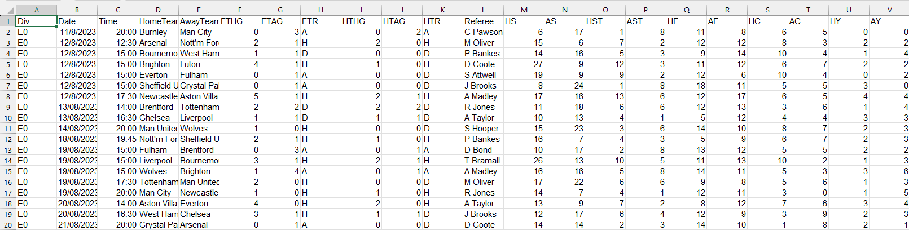
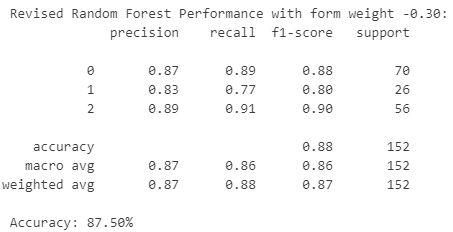
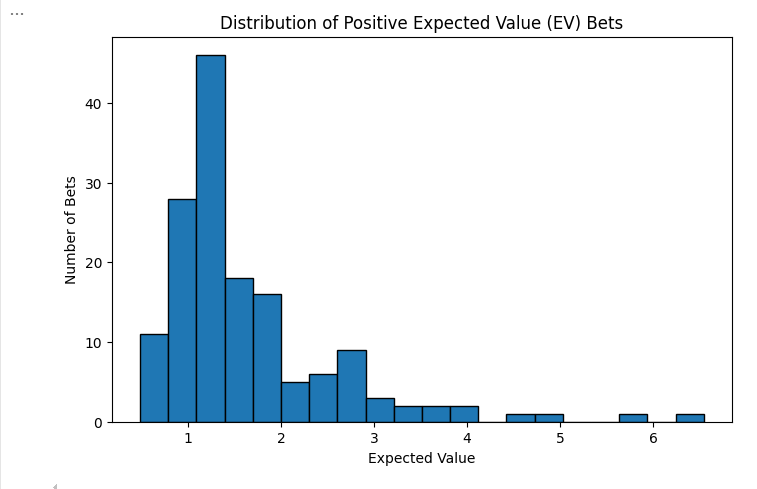
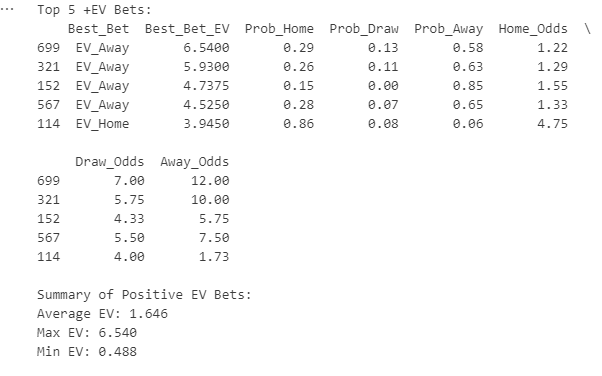

# sportsbetting-ev-prediciton
**Defining the Project** 

**What problem are we solving?** The objective of this project is to develop a predictive model analyzing historical data from the English Premier League to compute betting odds with higher expected values than bookmakers' odds. To make a positive return on interest, a sports bettor has to win approximately 53% of bets to make up for the bookmaker’s cuts, a statistically unlikely percentage over a large sample size. Accurate predictions based on various performance metrics will support sports bettors in making a positive return on investment. 

**Methods Used:** 
The publicly available dataset retrieved for this project from football-data.co.uk comprises English Premier League (EPL) match data. The dataset includes bookmaker odds, recent form metrics, and match outcomes (Home Win, Draw, Away Win) from season 1993/1994 to the current season 2024/2025. The CSV (Comma-Separated Values) dataset is structured in tabular format with a total of 106 attributes, the most relevant being: Date, HomeTeam, AwayTeam, FTR (Match Result), B365H (Home Odds), B365D (Draw Odds), B365A (Away Odds). For this project, the data from seasons 2022/2023 and 2023/2024 are specifically in usage to keep the results relevant and have a large sample size of historical data.

Figure 1: Raw CSV Dataset Snippet

**Data Cleaning & Preprocessing:**
Handled Missing Data: Implemented strategies with the intention of maintaining as many rows as possible. To prevent any null/empty data from interfering with the prediction model, any rows with a null/empty value were dropped from the data frame.
Reduced Dimensionality: To increase readability for the project and remove possible sources of noise for the prediction model, the data frame was stripped of all columns deemed irrelevant.

**Simple Cleaning:** As can be seen above, the columns were renamed for better legibility. The date data was also converted from text to pandas datetime format. The results were numerically encoded (Home win = 0, Draw = 1, Away win = 2) to facilitate model training.
**Data Normalization:** By calculating the implied probabilities of the bookmakers’ odds (implied odds = 1 / odds), we can find the likelihood of a bet succeeding. Totalling the implied odds gives the overrounding value (bookmakers’ profit margin). It is apparent by the percentage of the total implied probability that exceeds 1.0. Adjusting the implied probabilities to sum to 1.0 effectively removes the overound, returning the true odds.

**Data Analysis:** We looked at the statistics for our dataset to identify possible outliers and undersampled outcomes that will need additional class weighting to account for.

**Feature Engineering:** To make the prediction model consistent and raise overall accuracy while balancing noise, additional features had to be workshopped.

**Recent Form:** A team’s recent form can be a valuable predictor of upcoming match performance. Taking into account a team’s previous ten results gives insight not typically included in bet prediction. Two new columns with an average of the team’s past form between -1 to 1 were appended to the data frame: ‘Recent_Form_Home’ and ‘Recent_Form_Away.’
**Dynamic Weighting System:** Momentum is difficult to quantify using a set weighting scale, therefore we developed a dynamic weighting system that finds the weight value best fit to increase prediction accuracy for the dataset. The system loops through a range of weights from -1 to 1, with intervals of 0.1. The weightage returning predicted values with the highest accuracy in terms of matched predicted values to the historical values is stored as the best fitting weightage.

**Model and Results:**
We evaluated four models to identify the best fit for the data: unbalanced logistic regression, balanced logistic regression with class weighting, gradient shading, and random forest. The unbalanced logistic regression achieved an overall accuracy of approximately 59% but struggled to predict draws effectively, resulting in very low recall for that class. Balanced logistic regression and gradient shading improved recall and fairness while maintaining similar accuracy.

The model we found to be most fitting for the dataset is random forest classification. It is well-suited for classification problems involving tabular data. It functions by binding multiple decision trees using random subsets of the 80% of data allocated for testing. At each split in the tree, the model determines the most apt features to acknowledge. By combining many of these models, it creates a strong majority prediction.

Random Forests are robust to overfitting, can handle noisy data, and provide feature importance scores, which help interpret model decisions. In the context of sports betting, where the data may contain numerous correlated Random Forests can effectively manage complexity and identify key predictors. 

The random forest model initially underperformed, achieving around 51% accuracy. However, after expanding the dataset to include additional seasons (2023 and 2024) and applying recent form weighting, random forest performance improved significantly, surpassing 70% accuracy and outperforming both logistic regression models. This confirmed random forest as the most fitting model for the dataset, particularly when enriched with dynamic weighting.

Figure 5: Classification Report of Random Forest Performance

Beyond predictive metrics, we calculated the expected value (EV) of betting on each match outcome using the model probabilities and bookmaker odds. We identified 76 positive EV bets in the test set, achieving an average EV of 0.78 and a maximum EV of 1.9. A backtest simulation, placing $1 on each positive EV bet, resulted in a total profit of $7.86 and an average return on investment (ROI) of 10% per bet. These results suggest that, under historical conditions, our system could theoretically identify profitable betting opportunities.

Figure 6: Positive EV Distribution Visualization

Figure 7: Summary of Highest EV bets

**Discussion:
**We initially expected random forest to outperform logistic regression due to its flexibility in handling nonlinear patterns and complex interactions. Early tests, however, showed that with limited features, simpler models performed better. Once we expanded the dataset and incorporated recent form weighting, random forest’s performance improved dramatically, validating the model’s strength when given richer data.
A key takeaway was the importance of feature engineering and data preparation over simply applying advanced models. We also learned that balancing the logistic regression model significantly improved predictions on underrepresented outcomes like draws, but ultimately, random forest delivered the best overall performance. Another important lesson was that adding weak or noisy features can harm performance, reinforcing that careful feature selection matters as much as model choice.

**Conclusion: 
**In summary, this project demonstrated that random forest, when combined with enriched data and dynamic recent form weighting, can effectively identify positive expected value (EV) betting opportunities using historical English Premier League data. By thoughtfully applying machine learning techniques and evaluating outcomes through backtesting, we achieved an average ROI of 10% on historical test data.
This project highlighted the importance of both model selection and data preparation in predictive sports analytics. For future work, we would explore expanding the feature set, integrating live data streams, and testing the system across multiple leagues to further improve predictive accuracy and robustness. Incorporating player-level statistics, lineup changes, and injury reports could significantly improve predictive power as well. 
